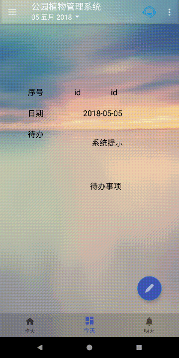

# big-project
 作者Android Studio边学边实践的项目，同项目含有Eclipse 服务器

该项目为北京理工大学自动化学院2015级软件工程导论的课程作业。

本项目的主题是公园植物管理系统

#### 实现**功能**：

添加备忘录（植物状态）

后台反馈添加计划事项（后台程序由另外一名同学编写）

同时可以手动添加待办事项

后期添加了技术咨询或者说群聊功能

#### 实现**原理**：

jdbc操作数据库

tomacat服务器接收图片

花生壳内网映射（非广告，公网ip难搞）

一些其他的开源UI以及代码。

#### 目录

**eclipse**目录为服务器源代码tomacat

**m  1**文件夹是另外一位同学使用C#写的后程序 新的UI框架（PWF），比他之前的界面好看

**Left_ship -  (16) - gradle-4.6-start.zip**是Android studio上交的作业版本

https://github.com/1997huoda/RGD

为AS可用的github连接，但是不保证是最新的，我没有review代码。

**app-release.apk**为生成的相应安装包

**APP说明.pptx** 是作者后续看到的一些的UI

https://github.com/1997huoda/eg.AS  

保存的是Android Studio中使用的开源代码以及相关例程

数据库说明.txt是数据库的格式，不规范。

#### 效果

登录效果

还是觉得之前的图也挺不错的，附旧图

PC登录界面（用户名和密码已经该过了m    1）

添加备忘录

添加任意时期的备忘录（通过日历控件选择日期）

任意时期日程安排（通过日历控件选择日期，两者的动画稍微不同）

技术咨询（聊天功能，本项目简易开发，功能类似单个QQ群聊）

记录第一次成功通讯

两个手机客户端的演示

手机同电脑客户端的演示（电脑端稍微有延迟，略略略，不是我的问题）

上报功能

上报植物信息，后台会对日历事件进行修改，APP、PC上的数据也都会更新

上报时可以上传图片，PC端管理人员可以更好的查看植物的状态

上报后，管理人员可以添加指示

其他app界面

其他PC客户端界面

### 其他动画以及截图见GIF文件夹

PS.1	甘特图

​	