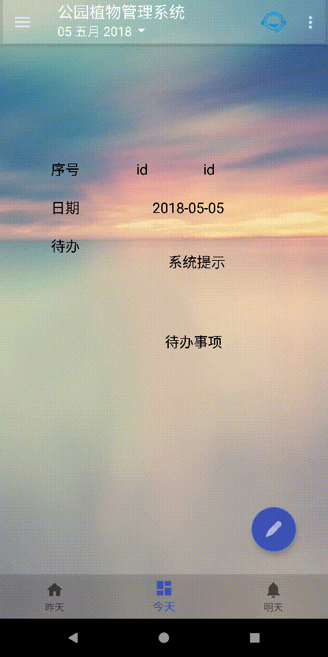

# 本markdown显示项目效果

##### 登录界面

附旧版

PC登录界面（用户名和密码已经该过了m    1）

##### 技术咨询

记录第一次成功通讯

##### APP截图

|       |      |      |       |
| :-: | :-: |
|      |       |       |      |

添加备忘录

侧滑栏以及其他界面演示

其他PC客户端界面

PC设置主题

